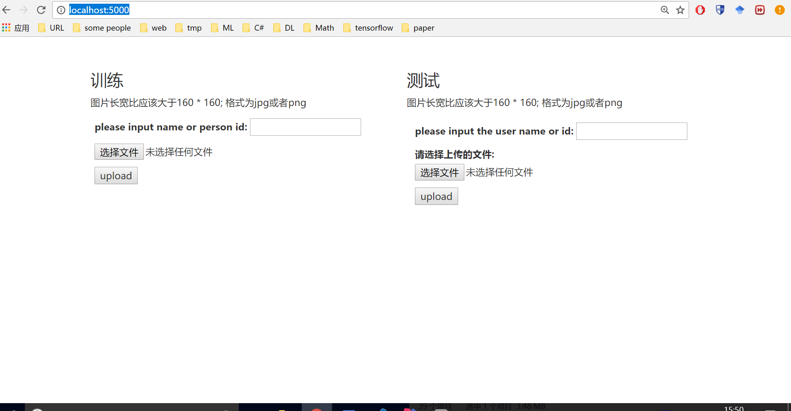
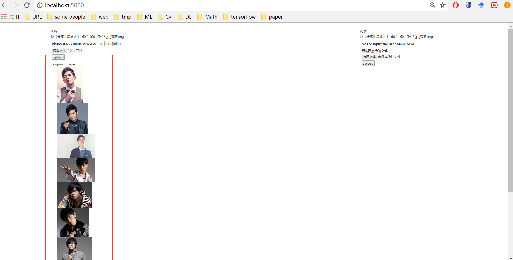
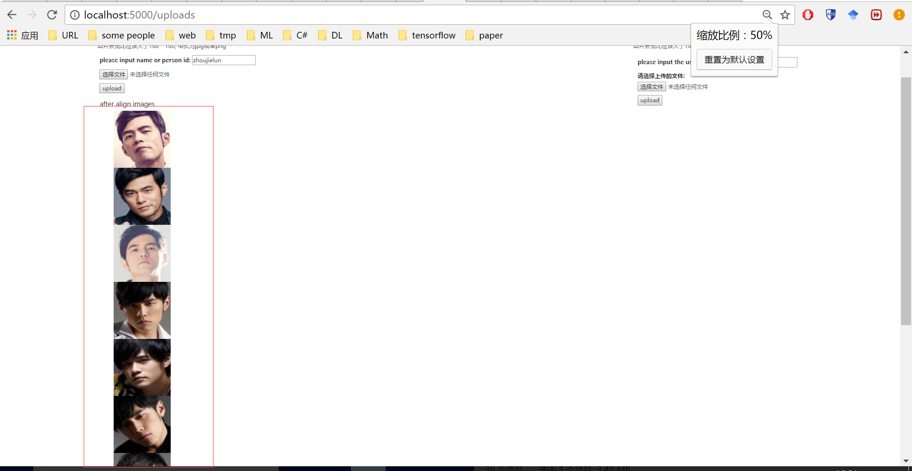
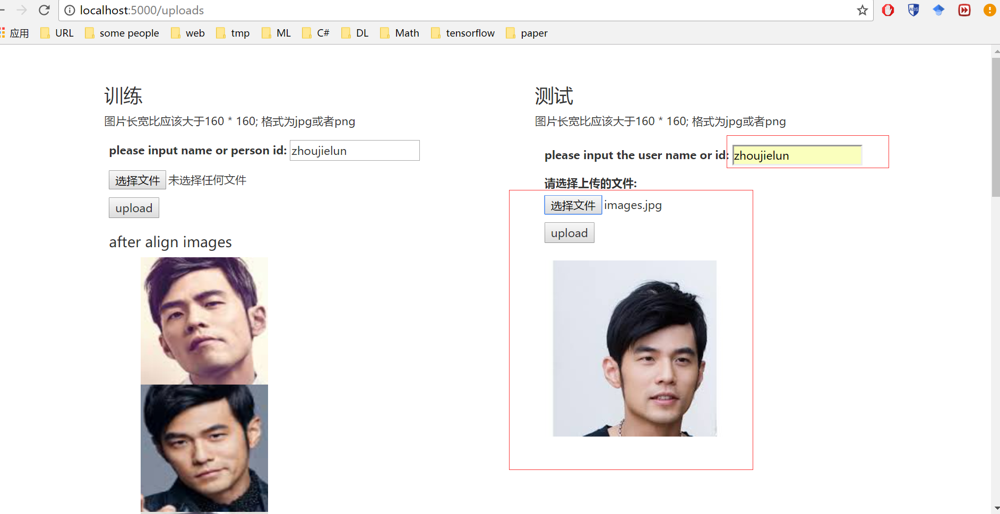
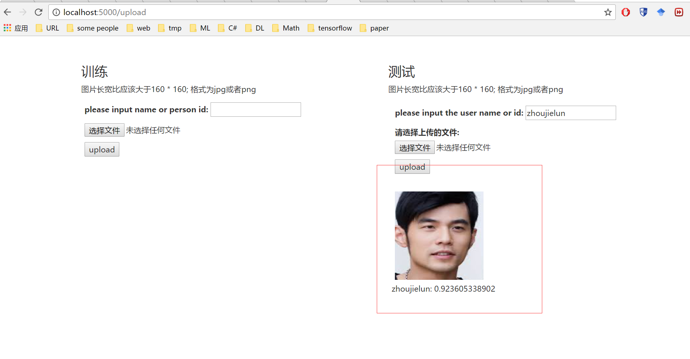

# face-recognition
> a simple face recognition system based on [facenet](https://github.com/davidsandberg/facenet)  
> 一个基于facenet的人脸识别系统(BS)

## usage
> 为一个要识别的用户上传若干张图片(理论上越多越好，一般在十张左右)，然后系统会在上传的图片中找到人脸的位置对图片进行剪裁，然后用这些剪裁后的图片作为训练集
为该用户训练一个模型；然后再次上传一张图片，系统可以识别出该张图片中的人脸是不是要识别的用户。

## install
> ### prepare
> 首先安装python环境.
> linux or macos自带python环境, windows需要另外安装[url](https://www.python.org/downloads/windows/).  
> 如果是linux or macos 推荐使用默认的pyhton2.7.x版本,对应的tensorflow版本也是python2.7.x版本,  
> 如果是windows环境,只能选择安装python3.5.x版本, 因为tensorflow对windows只支持python3.5.x版本.

> ### clone this reposity
> linux & macos自带git 所以只需打开shell, 执行 git clone https://github.com/lttzzlll/face-recognition.git   
> windows没有git, 可以选择首先安装git, 然后在 cmd 命令界面或者是powershell界面 执行 git clone https://github.com/lttzzlll/face-recognition.git  
> 或者是转到该[url](https://github.com/lttzzlll/face-recognition.git), 在界面上的 clone or download, 选择download  
> git下载安装[url](https://git-for-windows.github.io/), 下载之后点击安装，一路按确认. 安装完成后在cmd界面或者是powershell界面输入 git查看是否安装成功

> * install for linux(ubantu)  
>> 打开shell执行 git clone https://github.com/lttzzlll/face-recognition.git,  
>> cd 进入 face-recognition路径, 然后执行 pip install -r requirement.txt

> * install for macos  
>> 打开shell执行 git clone https://github.com/lttzzlll/face-recognition.git,  
>> cd 进入 face-recognition路径, 然后执行 pip install -r requirement.txt

> * install for windows  
>> 使用cmd或者powershell转到该文件夹下,然后执行 pip install -r requirement.txt,安装相关的依赖库
> * install with docker  
> 跨越所有这些平台的方法目前就是使用docker虚拟化环境,前提是所使用的平台已经安装好了docker,剩下的就是给出一个镜像.
> docker对linux最友好,macos和windows次之,可能需要安装virtualbox虚拟机来为要运行的程序专门虚拟化一个环境.

## project intro
> 下载完仓库代码之后进入该文件夹,因为要读写文件,所以设置一下该文件夹的共享及权限设置为Everyone, 可以读写和执行  
> 下载一个文件[url](https://drive.google.com/file/d/0B5MzpY9kBtDVZ2RpVDYwWmxoSUk/edit), 放在face-recognition下面, 直接拿别人训练好的模型使用  
> 在face-recognition文件夹下新建文件夹uploads, 在uploads文件夹下新建四个文件夹train, train_align, test, test_align  
> uploads用来存放用户上传的图片,其中train用来存放用户上传的原始图片,以用户名或者用户ID作为子文件夹
> train_align用来存放剪裁后只剩脸部的图片  
> test和test_align用来存放测试图片,属于临时文件夹    
> 在face-recognition下新建文件夹 classifiers, 用来存放训练好的每个人的分类器
## test
> 分两个阶段, 训练和测试  
> 训练阶段用来添加一个人的照片,测试阶段用某个人的照片测试是否为某个人的照片  
> 在cmd或者powershell中输入 python app.py 启动该程序  
> 浏览器转到 http://localhost:5000/ 查看结果  
>* 主页  
>* 待上传的图片应该大于160 * 160  
>* #### 训练  
>* 添加一个待识别的人员 输入姓名并选择一定数量的图片  
>* 选择十张周杰伦的图片  
>* 上传之前  
>* 上传之后, 上传的过程比较慢  
>* #### 测试  
>* 输入待测试人员的名称并选择一张图片  
>* 输入zhoujielun并上传他的一张图片(不同于之前的图片)
>* 结果1, , 识别的过程很慢  
>* 如果是本人的图片, 系统会返回检查后的图片并给出概率
>* 结果2   
>* 如果不是本人的图片,系统会显示上传的图片不是测试者的图片   

### promotion
> 有很多可以改进的地方，让这个系统运行的更快
> 1. 预加载模型，实例化一个持有该模型的变量，然后注入到程序中
> 2. 不用每次都把 图片先存在磁盘上再读取，数据量少的情况下可以直接放入内存进行处理
> 3. 离线去做一些优化